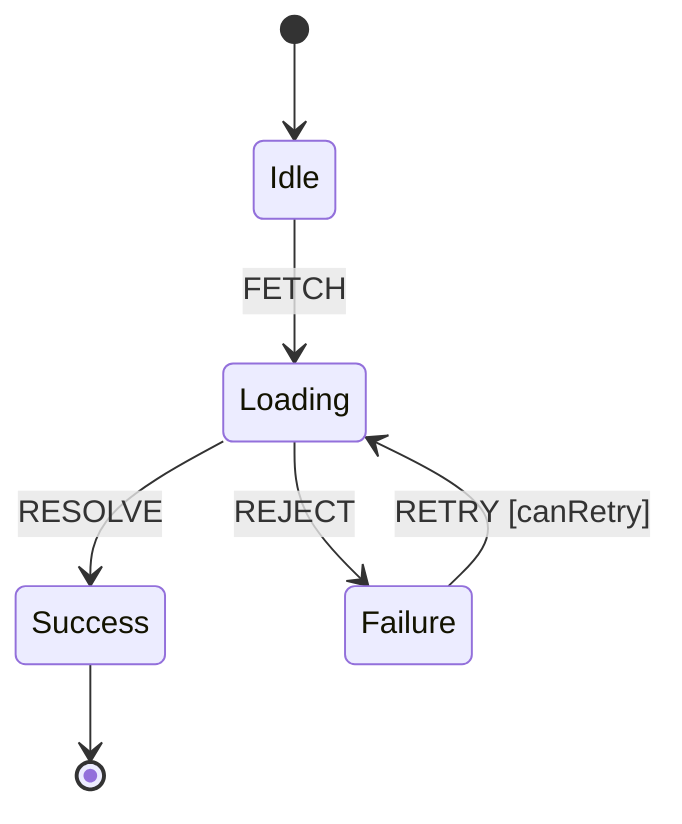
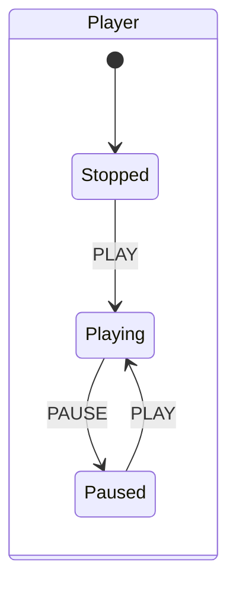
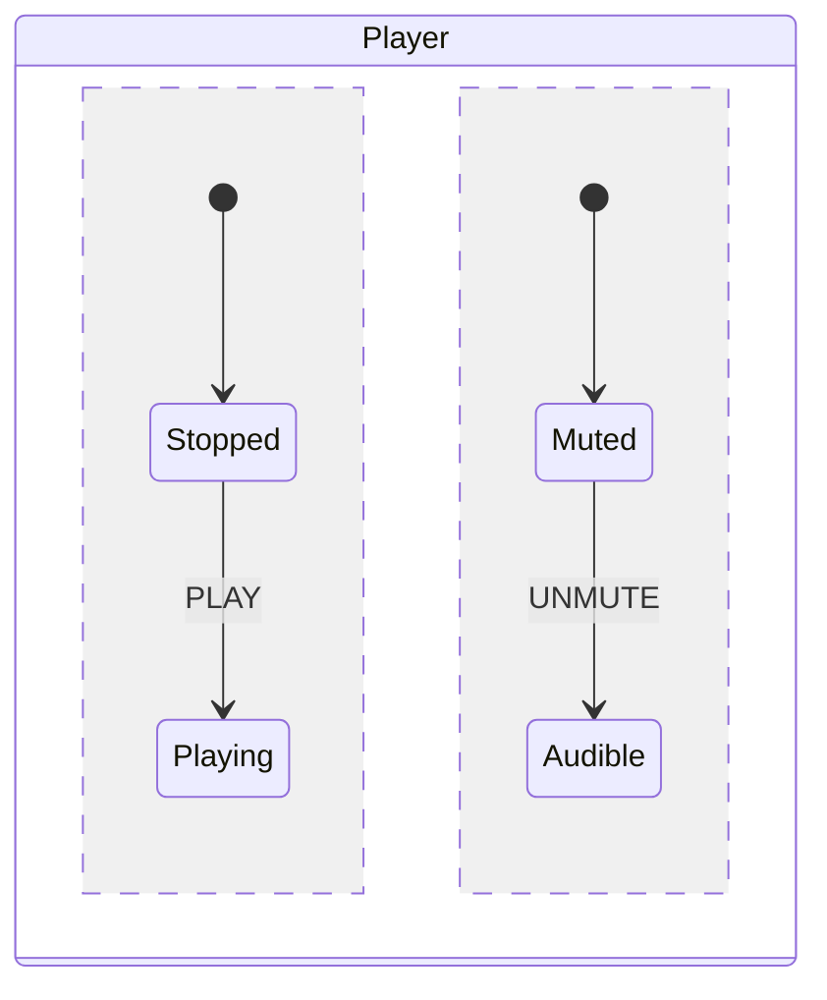
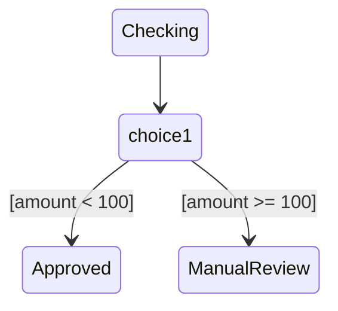

# Visualization Format

Every use of this skill ends with a visual deliverable. Never just prose. Author the machine once, as the JS `machine` object below, then derive whichever visual you produce from that object. Never re-derive a diagram from memory of the design. Do that and the two will drift apart, and you won't notice until they already have.

## Three tiers, escalate only as far as the machine actually demands

1. **Mermaid** (default). Flat or shallowly-nested machines, no history state, no more than roughly two regions, no guard-crowding, no explicit ask to interact. Cheapest option. Embeds directly in a reply or a PR description.
2. **`state-machine-cat` static SVG**. Reach for this when the machine needs full Harel-completeness in the picture but doesn't need to be played with. Any **history state** forces this tier, Mermaid cannot render one at all (confirmed empirically, see below). So does a hierarchy-plus-parallel-region combination complex enough that Mermaid's layout gets hard to read. Still a static deliverable. Just a more capable renderer.
3. **Interactive HTML/JS simulator**. Reach for this when the point is to explore the machine (the user asks to "try it," "simulate it," "play with it"), when more than roughly two guards compete over one event and the reason a transition is blocked needs to actually be visible, or when `state-machine-cat` isn't reachable in the current environment, no `npx`, no network.

Don't jump straight to tier 3 just because tier 1 falls short. Check whether tier 2, a correct and complete picture with no interactivity needed, already answers the need.

### Why Mermaid isn't always enough

We checked this. We didn't assume it. Mermaid's `stateDiagram-v2` has no history-pseudostate support at all. No `<<history>>`, no `[H]`/`[H*]`, nothing, and it's absent from Mermaid's own syntax docs (we fetched mermaid.js.org's state-diagram reference directly to confirm). Parallel regions (`--`) and choice pseudostates (`<<choice>>`) are confirmed first-class, so neither of those alone forces an escalation. Only a history state does. Or a layout that's genuinely become hard to read.

## Tier 1: Mermaid `stateDiagram-v2`

Pick the pattern that fits. Don't force every machine into the same shape.

**Flat machine:**



Guards render as `Event [guard]`, transition actions as `Event / action`.

**Compound (hierarchy):**



**Parallel regions** (confirmed supported, via the `--` divider):



**Guarded choice** (confirmed supported, via `<<choice>>`). Use this when more than about two guards compete over one event, instead of stacking guard labels on a single edge:



**History**: don't attempt it in Mermaid. Go straight to the `state-machine-cat` track below.

## Tier 2: `state-machine-cat` static SVG

[`state-machine-cat`](https://github.com/sverweij/state-machine-cat) (`smcat`) is built specifically for statecharts. Not a generic UML tool. Its vocabulary maps straight onto [GLOSSARY.md](GLOSSARY.md): states, transitions, guards, history (shallow and deep), parallel regions, choice/fork/join. It round-trips through SCXML natively, which fits this skill's own anchor spec. Render it locally and embed the static SVG output. This stays inside the Artifact tool's self-contained constraint, since the final deliverable is inert vector markup, not a live external call.

```bash
npx --yes state-machine-cat machine.smcat -T svg -o machine.svg
```

No system Graphviz install needed. It falls back to a bundled wasm renderer automatically, we confirmed this ourselves. `npx` needs network access once, to fetch the package. Rendering itself then runs fully offline.

**Syntax.** One comma-separated declaration list for states, closed by exactly one trailing semicolon for the whole list. Transitions follow as their own semicolon-terminated statements. Get that wrong, put a stray semicolon in the middle of the declaration list, and you get a parse error confusingly reported at line 1. We hit this ourselves while verifying the tool. It is not hypothetical. A compound state's history pseudostate is referenced as `<own-name>.history`, from inside that same state's block. Mark a container as parallel with `.parallel` on its name.

```
initial,
"power off",
player.parallel {
  playback {
    playback.history;

    stopped -> running: PLAY;
    running -> paused: PAUSE;
    paused -> running: PLAY;
    running -> stopped: STOP;
  },
  volume {
    muted -> audible: UNMUTE;
    audible -> muted: MUTE;
  };
},

final;

initial => stopped;
player => "power off": power out;
"power off" => playback.history: restore power;
```

We rendered this exact example while building this skill and checked the output ourselves. All seven state labels present, real path and text elements in the SVG, no system Graphviz needed.

## Tier 3: self-contained HTML/JS simulator

The skill's `assets/simulator-template.html` ships a tiny hand-rolled interpreter. Not a state-machine library. Fill in only the delimited block:

```html
<!-- FILL START: machine definition -->
const machine = { /* ... */ }; const guards = { /* ... */ }; const actions = {
/* ... */ };
<!-- FILL END -->
```

Plus the `<title>` and the favicon meta. Leave the interpreter, the renderer, and the CSS below the markers untouched. This is what stops the interpreter from getting subtly re-authored, and subtly wrong, on every single use.

**The `machine` object.** The single source of truth, written before any diagram:

```js
const machine = {
  id: "player",
  initial: "stopped",
  context: { volume: 5 },
  states: {
    stopped: { type: "atomic", on: { PLAY: [{ target: "playing" }] } },
    playing: {
      type: "compound",
      initial: "running",
      on: { STOP: [{ target: "stopped" }] },
      states: {
        running: { type: "atomic", on: { PAUSE: [{ target: "paused" }] } },
        paused: { type: "atomic", on: { PLAY: { target: "running" } } },
      },
    },
  },
};
const guards = {}; // name -> (context) => boolean
const actions = {}; // name -> (context) => void, may mutate context
```

`type` is one of `atomic | compound | parallel | final`. For a `parallel` state, `states` holds one entry per **region**, each independently active. Put `history: "shallow"` on a transition object to resume a compound target's last-active child instead of its default `initial`. State ids must stay unique across the whole machine, not just within one region, since the interpreter resolves targets through a single flat registry.

**The dispatch function** walks the current **configuration** (one active leaf per region, see GLOSSARY.md). For an incoming event: find each region's matching transition, evaluate its `guard`. On the first pass: run the source's exit actions, then transition actions (these may mutate `context`), then resolve the target (descending into a compound state's `initial`, or its remembered child if `history: "shallow"` was requested), then run the target's entry actions, then log the transition, then re-render. A guard that evaluates false gets recorded as a **blocked** attempt. It is never silently dropped. Seeing why nothing happened is the entire reason this tier exists over a static diagram.

**Layout.** State diagram on the left, full height. A sidebar on the right, stacked top to bottom: **event buttons** (one per event valid anywhere in the current configuration; a button whose guard currently fails stays visible, dimmed, labeled with the guard that's blocking it, never hidden outright), then a **context inspector** (a live key/value view of `context`), then a **transition log** (newest first, both taken and blocked attempts). A reset button in the header re-initializes configuration and context. Dark and light handled purely through `@media (prefers-color-scheme: dark)` plus a `:root[data-theme]` override. No JS toggle needed.

**Not supported by this template.** Say so plainly if a design needs one of these. Don't quietly half-implement it: deep history replay beyond one level, delayed or `after` transitions, invoked child actors, an internal event queue, `raise`d internal events. If a design genuinely needs one of these, say that out loud instead of growing the toy interpreter toward SCXML-completeness one use at a time.

## Delivery

Try the Artifact tool first. A Mermaid block embeds directly in a markdown reply (tier 1). A `state-machine-cat` SVG can be inlined into a markdown or HTML artifact as-is, since it's already static (tier 2). The filled `simulator-template.html` publishes directly as a hosted page (tier 3). If the Artifact tool isn't available in the current context, write the self-contained HTML or SVG to the OS temp directory (`$TMPDIR`, falling back to `/tmp`) and open it, `open` on macOS, `xdg-open` on Linux, `start` on Windows. Either way, tell the user exactly what got produced and where. The visualization is this skill's deliverable. Not an aside to mention in passing.
