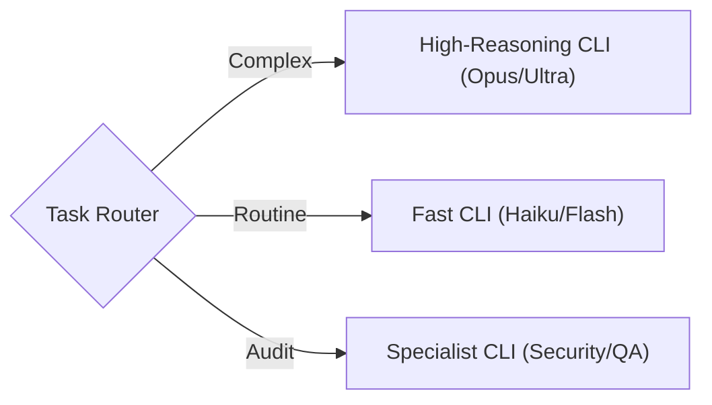

## Dependencies

This skill requires **Python 3.8+** and standard library only. No external packages needed.

**To install this skill's dependencies:**
```bash
pip-compile ./requirements.in
pip install -r ./requirements.txt
```

See `./requirements.txt` for the dependency lockfile (currently empty — standard library only).

---
# Orchestrator: Loop Router & Lifecycle Manager

The **Orchestrator** assesses the incoming trigger, selects the right loop pattern, and manages the shared closure sequence (seal, persist, retrospective, self-improvement).

## The Core Loop

### Ecosystem Context
- **Patterns**: [`learning-loop`](../learning-loop/SKILL.md) | [`red-team-review`](../red-team-review/SKILL.md) | [`dual-loop`](../dual-loop/SKILL.md) | [`agent-swarm`](../agent-swarm/SKILL.md) | [`triple-loop-learning`](../triple-loop-learning/SKILL.md)
- **Inner Loop Reference**: [`cli-agent-executor.md`](../../references/cli-agent-executor.md) — Persona configs for specialized CLI execution.

## Routing Decision Tree

Use this to select the correct loop pattern:

```
1. Does the trigger mention unguided friction evaluation, tests, and self-optimization?
   └─ YES → Pattern 5: triple-loop-learning
   └─ NO → continue

2. Is this work I can do entirely myself (research, document, iterate)?
   └─ YES → Pattern 1: learning-loop
   └─ NO → continue

3. Does it need adversarial review before proceeding?
   └─ YES → Pattern 2: red-team-review
   └─ NO → continue

4. Can the work be split into parallel independent tasks?
   └─ YES → Pattern 4: agent-swarm
   └─ NO → Pattern 3: dual-loop (sequential inner/outer delegation)
```

| Signal | Pattern | Skill |
|--------|---------|-------|
| Research question, knowledge gap, documentation task | **Simple Learning** | `learning-loop` |
| Architecture decision, security review, high-risk change | **Red Team Review** | `red-team-review` |
| Feature implementation, bug fix, single work package | **Dual-Loop** | `dual-loop` |
| Large feature, bulk migration, multi-concern parallel work | **Agent Swarm** | `agent-swarm` |
| Systemic rules generation, autonomous meta-optimizations | **Triple-Loop** | `triple-loop-learning` |

### Process Flow
0.  **Interactively Determine CLI and Model (ask once during bootstrap)**: Before initiating delegation or preparing packets, you must interactively prompt the user to select their desired execution setup. Ask:
    - *"Which LLM CLI backend would you like to use for sub-agent execution?"* (Options: `agy`, `claude`, `copilot`, `codex`, `llama`).
    - *"Which specific model should be used?"* (Options/defaults per backend, e.g., `Gemini 3.5 Flash (Low)` or `gemini-3.5-flash` for `agy`).
    Record their choice and pass it to the sub-agent runner (`run_agent.py`) using the `--cli` and `--model` flags, ensuring you append `< /dev/null` to prevent `SIGTTIN` process halts.
1.  **Plan (Strategy)**: You define the work (Spec → Plan → Tasks). When planning scripts/pipelines, default to a "Modular Building Blocks" architecture (CLI wrappers + independent core modules).
2.  **Delegate (Handoff)**: You pack the context into a **Task Packet** and assist the user in handing off to the Inner Loop.
3.  **Execute (Tactics)**: The Inner Loop agent (which has *no* git access) writes code and runs tests.
4.  **Verify (Review)**: You verify the output against acceptance criteria.
5.  **Correct (Feedback)**: If verification fails, you generate a **Correction Packet** and loop back to step 3.
6.  **Retrospective (Learning)**: You assess the loop's success and document learnings.
7.  **Primary Agent Handoff (Closure)**: You signal the repository environment to seal the session, update databases, and commit to Git.

## Roles

### You (Outer Loop / Director)
- **Responsibilities**: Planning, Git Management, Verification, Correction, Retrospective.
- **Context**: Full repo access, strategic constraints (ADRs), long-term memory.
- **Tools**: `agent-orchestrator`, `git`, and optionally any upstream planning tool.

### Inner Loop (Executor / Worker)
- **Responsibilities**: Coding, Testing, Debugging.
- **Context**: Scoped to the Task Packet ONLY. No distractions.
- **Constraints**: **NO GIT COMMANDS**. Do not touch `.git`.
- **Tools**: Editor, Terminal, Test Runner.

## Commands

You orchestrate workflows by natively executing the `agent_orchestrator.py` script provided by this skill (located in `scripts/`).

### 1. Planning Status
> ⚠️ **Note:** A `scan` CLI subcommand is not currently implemented in `agent_orchestrator.py`.
> Perform spec readiness assessment manually or via native file reads before delegating.

### 2. Delegation (Handoff)
When a task is ready for implementation, generate a Task Packet using the `packet` command.
```bash
python ./scripts/agent_orchestrator.py packet --wp <WP-ID> --spec-dir <PATH>
```
This generates a markdown file in the `handoffs/` directory. You must then instruct the user/system to launch the Inner Loop with this file.

### 3. Verification & Correction (Trust But Verify & TDD)

You must check all outputs of the agents you orchestrate. **No blind trust is allowed.** Check the Inner Loop's work against the packet using the `verify` command:
```bash
python ./scripts/agent_orchestrator.py verify --packet handoffs/task_packet_NNN.md --worktree <PATH>
```

Follow these strict verification rules:
- **TDD Enforcement**: Running tests is mandatory. Verify that code is functionally proven and passes the test suite. If tests are missing, reject the package until tests are written.
- **Delta Inspection**: Check modified files directly. Review all logic adjustments for stubs, stales, or architectural regressions.
- **Continuous Loop Improvement**: For any failure, evaluate the retrospective data and modify the templates, prompts, or reference instructions to prevent repeat failures (continuous learning).

If the work fails criteria, use the **Severity-Stratified Output** schema to generate a structured correction packet:

- 🔴 **CRITICAL**: The code fails to compile, tests fail, or the requested feature is entirely missing. (Action: Hard reject, return to Inner Loop with exact error logs).
- 🟡 **MODERATE**: The feature works, but violates project architecture, ADRs, or performance standards. (Action: Flag for revision, return to Inner Loop with the specific ADR reference).
- 🟢 **MINOR**: The feature works and follows architecture, but has minor naming or stylistic issues. (Action: Do not return to Inner Loop. The Orchestrator fixes it directly and proceeds).

Generate the correction packet to send back to the Inner Loop:
```bash
python ./scripts/agent_orchestrator.py correct --packet handoffs/task_packet_NNN.md --feedback "Specific failure reason"
```

### 4. Parallel Execution (Agent Swarm)
For bulk operations or partitioned tasks, use the `swarm_run.py` script from the `agent-swarm` skill.
```bash
python ./swarm_run.py --job <JOB_FILE> [--resume]
```
This is the designated route for all Pattern 4 triggers.

### 4. Dynamic Routing (Model Agnostic)
As the Orchestrator, you can route tasks to ANY capable CLI agent based on complexity:



### 5. Red Team / Peer Review
> ⚠️ **Note:** A `bundle` CLI subcommand is not currently implemented in `agent_orchestrator.py`.
> Use the `context-bundler` skill from `dev-utils` to compile files for external review instead.

### 6. Retrospective (Post-Loop Learning)
Generate a retrospective template to close the cognitive loop with structured learning, *before* signaling the environment to seal.
```bash
python ./scripts/agent_orchestrator.py retro
```
This creates a template in the `retros/` directory.

**Meta-Improvement**: After reviewing what went right/wrong, the orchestrator should also assess whether any **loop infrastructure** needs updating:
- **Skills** — Were SKILL.md instructions unclear or incomplete? Fix them.
- **Scripts** — Did any automation break or cause friction? Patch it.
- **Templates** — Were task templates missing fields or overly rigid? Refine them.
- **Diagrams** — Does the architecture diagram still reflect reality? Update it.
- **Personas** — Did a persona produce poor results? Tune it.

This makes each loop iteration smoother than the last.

### 7. Handoff to Primary Agent (Ecosystem Sealing)
Once the loop is complete and learning has been extracted, the Orchestrator MUST pass control to the environment's global sovereign (e.g., the primary agent plugin). 

**The Orchestrator explicitly DOES NOT:**
- Trigger `context-bundler:context-bundling` or update recursive language model (RLMs) summaries in caches.
- Trigger `persist_soul` or sync to HuggingFace.
- Execute Vector DB ingestion scripts.
- Execute Git commands (`git commit`, `git push`).

These are environment-specific actions owned entirely by the **Primary Agent**.

#### Session Closure

**Session Closure**

Execution complete. Run your environment's standard session closure sequence. If you are
using `agent-agentic-os`, trigger `os-improvement-loop` closure. If you are in a standalone
project, save any outputs to your preferred persistence location and close the session.

---


### 8. Sub-Agent Limitations
- Be aware that `claude-cli-agent` has a hard stop on passing massive context bundles (~5MB+) either natively via stdin or `--file`. If your payload exceeds context windows, you must write a semantic chunking script instead of blindly dumping a `context-bundler` package into a prompt!
- Automated sub-agent invocations will *silently fail* or throw an interactive block if you do not use `--dangerously-skip-permissions` (for `agy` / `claude`) or if the user is not authenticated natively using `claude login`.
- **CRITICAL**: When executing sub-agent commands in background or headless scripts (e.g., via `run_agent.py` or system subprocess runners), you must redirect standard input (e.g., `stdin=subprocess.DEVNULL` or `< /dev/null`) to prevent the operating system from suspending the process with a `SIGTTIN` signal, which hangs execution indefinitely.

## Lifecycle State Tracking

The orchestrator must verify these gates at each phase:

| Phase | Gate |
|:------|:-----|
| **Planning** | Spec or plan is coherent and broken into tasks. |
| **Execution** | Packets are generated and handed off. |
| **Review** | Output passes verification criteria. |
| **Retrospective** | Post-loop learnings extracted and infrastructure improved. |
| **Primary Agent Handoff** | Signal the global ecosystem to run Seal, Persist, and Git closure. |

**No phase may be skipped.** If a gate fails, the orchestrator must resolve it before proceeding.

### Loop Controls (Ralph-Inspired)

| Control | Description |
|---------|-------------|
| **Iteration Counter** | Increment each cycle. Log `"Loop iteration N of M"` at orientation. |
| **Max Iterations** | Safety cap. When reached, force-seal as incomplete with blocking notes. |
| **Completion Promise** | Deterministic exit: only declare done when acceptance criteria are genuinely met. |

### Automation

| Mechanism | Purpose |
|-----------|---------|
| **Stop Hook** (`scripts/closure_guard.py`) | Blocks premature session exit until Seal → Persist → Retrospective are complete. |
| **Red Team Subagent** | Red team review can run as a forked subagent to keep the main session context clean. |

---

## Best Practices

1.  **One WP at a Time**: Do not delegate multiple WPs simultaneously unless you are running a swarm.
2.  **Explicit Context**: The Inner Loop only knows what is in the packet. If it needs a file, list it.
3.  **No Git in Inner Loop**: This is a hard constraint to prevent state corruption.
4.  **Correction is Learning**: Do not just "fix it yourself" if the Inner Loop fails. Generate a correction packet. This trains the system logic.
5.  **Never Abandon Closure**: The orchestrator must shepherd Review → Accept → Retro → Merge. Stopping after delegation is a protocol violation.

6.  **Merge from Main Repo**: Always merge from the project root, never from inside a worktree.

---

## Research Basis

This skill implements the **"Dual-Loop Agent Architecture"** inspired by:

1.  **Self-Evolving Recommendation System** ([arXiv:2602.10226](https://arxiv.org/abs/2602.10226)):
    - Defines the specialized roles of **Planner (Outer)** vs **Executor (Inner)**.
2.  **FormalJudge** ([arXiv:2602.11136](https://arxiv.org/abs/2602.11136)):
    - Provides the theoretical framework for "Scalable Oversight" via structured verification rather than just human inspection.

